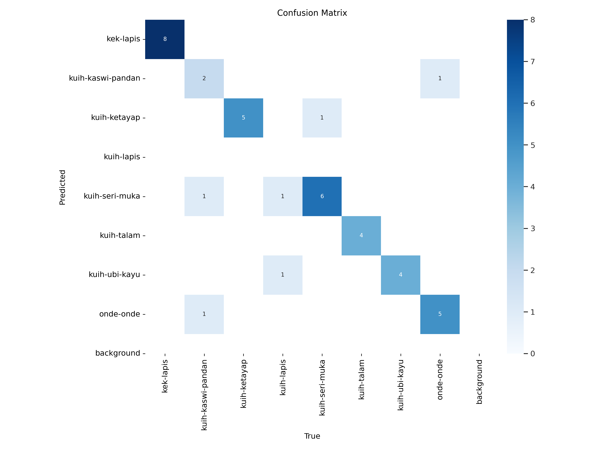
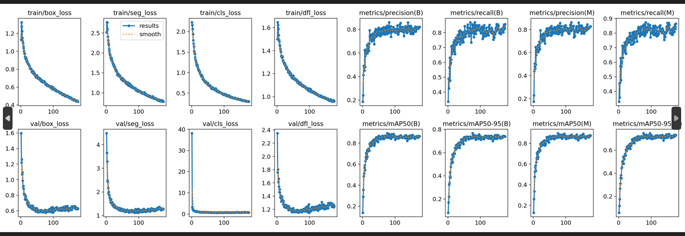
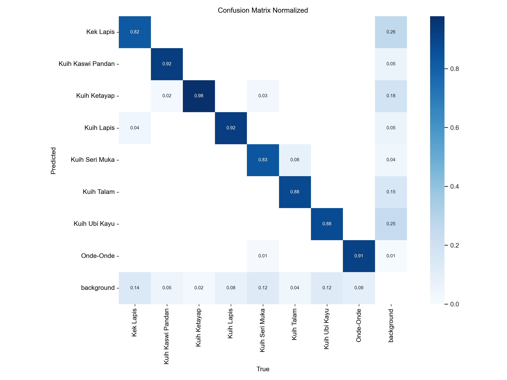
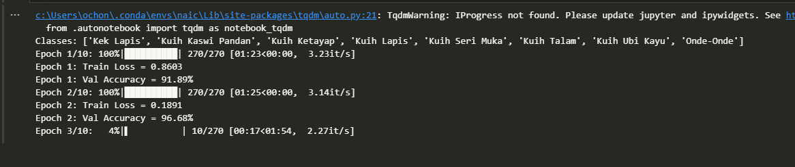

<p align="center">
  <a href="https://github.com/chong-yao/naic/raw/main/README.pdf">
    
  </a>
</p>

# NAIC (AI Technical) team: CantByteUs
## By:
**Chin Zhi Xian \
Ng Tze Yang \
Ong Chong Yao \
Terrence Ong Jun Han**

## Data Collection & Preparation
- Scraped 2500~ images per class from the internet using the Bing and Google search engines.
- Converted the images to tensors.
- Computed the tensor differences between images to find out the image similarities, thus removing duplicates effectively.
- Manually filtered unrelated images out (e.g., images with a huge YouTube logo on it), then combined them with some images taken by ourselves.
- Annotated a few of the kuih for segmentation using Label Studio; thus, we used our genuine original dataset, as the existing kuih datasets on dataset sharing platforms were not in segmentation format.
- Included a variety of images:
    - **High and low-resolution images.** Low-res images for the model to generalise better, and high-res for the attention layers to capture the minute detail.
    - **Varied lighting and angles** (to counter that most of the photos online were taken in optimal lighting and framing to be appealing for promotions and advertisements).
    - **Partially eaten kuih**

*Even Bing and Google search engines weren't really able to tell the difference between Kuih Lapis and Kek Lapis, and often got the two classes jumbled up too!*

## Dataset Annotation: Pseudo Labelling - a dataset annotation & semi-supervised training method

For each class:
1. Annotated 20-30 kuih per class based on feature complexity.
2. Trained a small YOLOv11-seg model to speed up annotation.
3. Used the model to annotate the remaining images, with manual verification.
5. Retrained a larger model with the combined manually annotated and model-annotated images.
6. Repeated the process until the dataset was complete.

*Attached image explains pseudo-labelling:*


Paper:```
Lee, Dong-Hyun. (2013). Pseudo-Label: The Simple and Efficient Semi-Supervised Learning Method for Deep Neural Networks. ICML 2013 Workshop : Challenges in Representation Learning (WREPL). We propose the simple and efficient method of semi-supervised learning for deep neural networks. Basically, the proposed network is trained in a supervised fashion with labeled and unlabeled data simultaneously. For un-labeled data, Pseudo-Label s, just picking up the class which has the maximum predicted probability, are used as if they were true labels. This is in effect equivalent to Entropy Regularization. It favors a low-density separation between classes, a commonly assumed prior for semi-supervised learning. With De-noising Auto-Encoder and Dropout, this simple method outperforms conventional methods for semi-supervised learning with very small labeled data on the MNIST handwritten digit dataset.```

Eventually, we plateaued with a raw dataset of 98 images in each class that were perfectly annotated by the model for its respective class.

7. Split the per-class dataset into 90 images for training and 8 images for validation.

8. We then uploaded all 784 ((90 + 8) × 8 classes) images to Roboflow for augmentation and to artificially increase the dataset size. This effectively tripled the dataset size while applying augmentations.

    *HOWEVER*, we purposely left the hue and color adjustment augmentations out because they would mess with how the model interprets the images, and because kuih identification is very color-sensitive.

9. Added a few non-kuih related images with no labels into the training split to reduce False Positives.

After all this, we also wrote a script to render all the segmentation annotations on top of the images and then place all of them into a grid to be neatly visualised.

*Attached image below shows our rendered final validation split, the different mask colors representing the 8 different classes:*

## Model Development
- Tools Used:
    - Our own computers for all training and inference.
    - CUDA for GPU-accelerated training.
    - PyTorch and the Ultralytics library.

- Initial Approach:
    - Directly edited the 'yolo11seg.yaml' model configuration file to increase depth, width, and channel capacity.
    - Added more attention layers.

- Problem: Large models tend to overfit on small-to-medium-sized datasets.

- Solution:
    - Trained a YOLOv11x-seg model from scratch on the full COCO 2017 dataset to preconfigure weights and biases.
    - Fine-tuned the model on the smaller kuih dataset.

We normalised the exposure of test images before inference to get a more consistent light balance all over the image, giving the model less of a hard time. But that could be solved by training the model with images preprocessed to have different exposure levels.

## Final Model: An Ensemble Approach

We chose an ensemble of a CNN segmentation model and a Vision Transformer (ViT) model.

### Why Segmentation?

The confusion matrix for the YOLOv11-cls (classification) models wasn't at all that impressive:

*Attached image shows the confusion matrix for YOLOv11m-cls model on a 50-images per class dataset:*


***"A robust segmentation model inherently improves classification accuracy"*** - It prioritises the core image (the kuih) and reduces distractions.

We started training segmentation models:
*Attached image shows training & validation metrics for the YOLOv11x-seg model:*


**Notice how the cls_loss plummeted after only a few epochs?**

True enough, the confusion matrix for the segmentation model was near-perfect.

*Attached image shows the confusion matrix for YOLOv11x-seg model on an 8-images per class validation split:*


### Why Vision Transformer?
Vision Transformers split the input image into patches, and then "transform" the patches into tokens (like words in LLMs).

***"ViTs can capture relationships across the entire image in every layer"***

Kuih may look visually similar (looking at kek lapis-kuih lapis & kuih seri muka-kuih talam similarities) BUT they have different textures that cannot be easily identified when only looking at a certain part of the image.

- ViTs use a 'self-attention' mechanism to analyse the entire image, capturing textures and long-distance relationships between image regions. Thus, even if a kuih looks slightly different across images, the ViT can still recognise it based on learnt patterns.

- Vision Transformers perform well and more efficiently (even surpassing CNNs) when pretrained on a large dataset.

- They perform well when pretrained on large datasets. We used the 'eva02_base_patch14_224.mim_in22k' model pretrained on ImageNet 22k.

*Attached image shows an instance of training the ViT:*


**Notice how fast the model converges even in the first few epochs?**

*Attached image below shows a separate instance of training the ViT:*


**ViTs plateau very fast** (look at epoch 17). ViTs' fast convergence tends to bring the risk of overfitting too; thus, we had to be careful and save the model at every epoch.

## Final Output: Combining CNN and ViT

**This is where we combined the outputs of the CNN and ViT to give an output.**

A soft voting method determines the final combined output of both models.

If the models agree, that class is chosen.

If they disagree, the class with the highest confidence from either model is chosen.

This hybrid approach outperformed solo models in classification tests.